# ECMX20ビルドガイド

- ECMX20は静電容量式スイッチ、メカニカルスイッチの両方に対応した自作キーボードキットです
  - 静電容量式スイッチで組み立てたあとにメカニカルスイッチで組み直すことは容易ですが、逆は難しいです
  - メカニカルスイッチの場合でも静電容量式と同様にスキャンするという今までにない方式のため、予期せぬ問題が発生する可能性があります

## 販売リンク
- [BOOTH](https://nogikes.booth.pm/items/2910601)


| 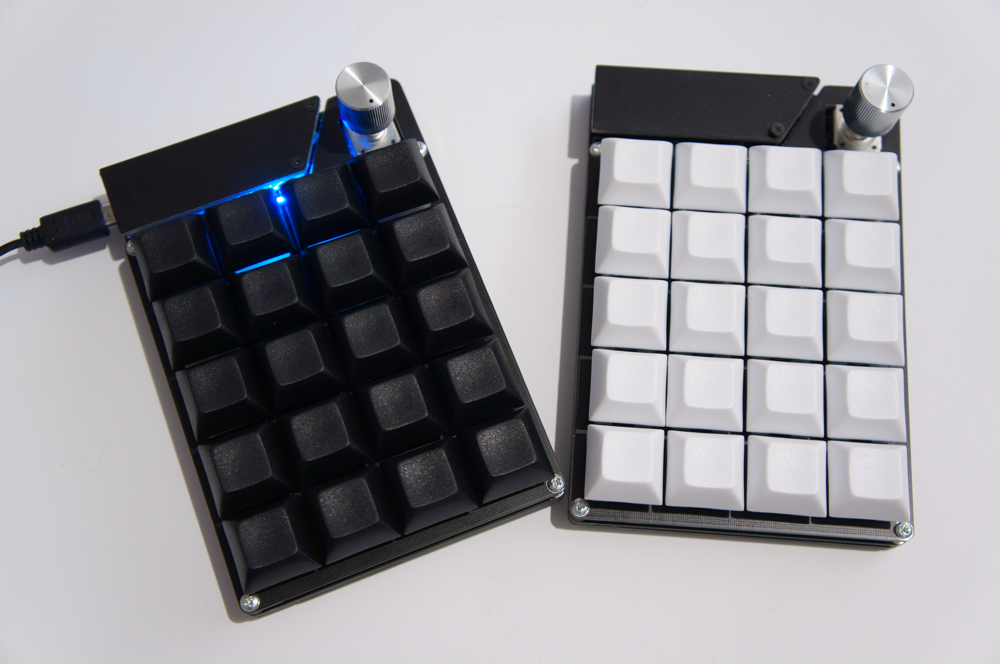 | 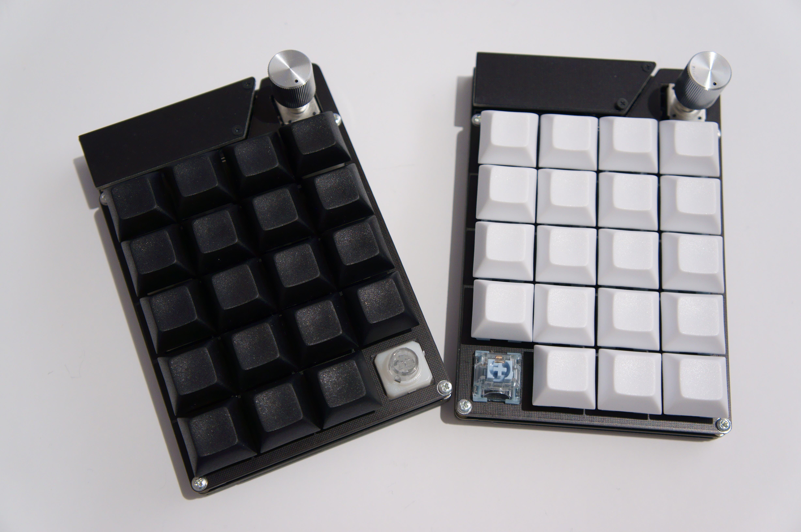 |
| ---------------------- | ----------------------- |

- [販売リンク](#販売リンク)
- [部品リスト](#部品リスト)
  - [キットに同梱されている部品](#キットに同梱されている部品)
  - [キット以外に必要な部品](#キット以外に必要な部品)
- [組立手順](#組立手順)
  - [メイン基板に部品をはんだ付けする](#メイン基板に部品をはんだ付けする)
  - [静電容量式スイッチの場合](#静電容量式スイッチの場合)
    - [スイッチを組み立てる](#スイッチを組み立てる)
    - [トッププレートの組立](#トッププレートの組立)
    - [全体の組立](#全体の組立)
  - [メカニカルスイッチの場合](#メカニカルスイッチの場合)
  - [(静電容量/メカニカル)Pro Microを取り付けてカバーをネジ止め](#静電容量メカニカルpro-microを取り付けてカバーをネジ止め)
  - [ゴム足、キーキャップをつける](#ゴム足キーキャップをつける)
  - [ファームウェアを書き込む](#ファームウェアを書き込む)
  - [動作点を調整する](#動作点を調整する)
    - [AD変換値を確認する](#ad変換値を確認する)
    - [しきい値を設定する](#しきい値を設定する)
    - [キー入力を確認する](#キー入力を確認する)
  - [キーマップ、LEDを設定する](#キーマップledを設定する)
  - [静電容量式スイッチのルブについて](#静電容量式スイッチのルブについて)

## 部品リスト
### キットに同梱されている部品

| 部品                     | 数  |
| ------------------------ | --- |
| メイン基板               | 1   |
| トッププレート           | 1   |
| ボトムプレート           | 1   |
| Pro Microカバー          | 1   |
| タクトスイッチ           | 1   |
| スキャン用モジュール     | 1   |
| ピンヘッダ               | 1   |
| LED(WS2812C-2020)        | 1   |
| M2ネジ                   | 12  |
| M2x8スペーサー           | 6   |
| ゴム足(大)               | 4   |
| ゴム足(小)               | 1   |
|                          |     |
| **静電容量式用追加部品** |     |
| ミドルプレート           | 1   |


### キット以外に必要な部品

| 部品                                   | 数       | 入手先                                                                                                                                                                                                                                                                                                                 |
| -------------------------------------- | -------- | ---------------------------------------------------------------------------------------------------------------------------------------------------------------------------------------------------------------------------------------------------------------------------------------------------------------------- |
| Pro Micro(BLE Micro Proは未対応です)   | 1        | 遊舎工房など                                                                                                                                                                                                                                                                                                           |
| USBケーブル                            | 1        | 遊舎工房など                                                                                                                                                                                                                                                                                                           |
| 12ピンコンスルーまたはピンヘッダ       | 2        | https://yushakobo.jp/shop/a01mc-00/<br> https://talpkeyboard.stores.jp/items/5e056626d790db16e2889233                                                                                                                                                                                                                  |
| キーキャップ                           | 20キー分 |                                                                                                                                                                                                                                                                                                                        |
| エンコーダ(Alps EC12互換)              | 1        | https://shop.yushakobo.jp/products/pec12r-4222f-s0024                                                                                                                                                                                                                                                                  |
|                                        |          |
| **静電容量式スイッチで組み立てる場合** |          |
| 静電容量スイッチ                       | 20キー分 | https://yushakobo.jp/shop/a0500es-01-1/<br>https://www.nizkeyboard.com/collections/ornaments/products/2019-new-niz-ec-switch<br>NiZのスイッチを使う場合は別途円錐バネを入手する必要があります                                                                                                                          |
| ラバードーム                           | 必要分   | https://yushakobo.jp/shop/a0500er-01-1/<br>https://shop.yushakobo.jp/products/des-domes-bke-tactile<br>https://www.nizkeyboard.com/collections/ornaments/products/ec-silicone-domes-35g-45g-55g<br>https://www.nizkeyboard.com/collections/ornaments/products/n-electrostatic-capacitive-silicone-dome-60g-65g<br>など |
|                                        |          |
| **メカニカルスイッチで組み立てる場合** |          |
| MX用ソケット                           | 20キー分 |
| MX互換メカニカルスイッチ               | 20キー分 |

## 組立手順
### メイン基板に部品をはんだ付けする
 - WS2812C-2020をLED裏側の緑線とシルクの白線が同じ側にくるように取り付る
    - ランドを大きめにしたので、ランドの長手方向にそってハンダゴテを滑らせるとはんだ付けしやすいです 
    - 熱に弱いので焦らず1ピンずつはんだ付けしていってください
    - この段階で動作確認したい場合は[テスト用ファーム](https://github.com/sekigon-gonnoc/ecmx20/releases/download/0.1/sekigon_ecmx20_test.hex)を書き込んでください。RGB_TESTパターンで点灯すればOKです
 - スキャン用モジュールを1番ピン(四角いランド)をあわせて表向きに取り付ける
    - ピンヘッダの長いほうがモジュール側です
    - ピンヘッダの長いほうはブリッジしやすいので、難しく感じる場合には短く切ってからはんだ付けしたり、ブリッジしてしまった場合にはハンダ吸い取り線などで取り除いたりしてください
 - エンコーダを取り付ける。静電容量式スイッチで組み立てる場合はロータリーエンコーダの裏側のピンのうち、最も太い2本を除く5本を短く切る
 - Pro Microは裏向きに取り付ける
   - コンスルーのはんだ付け注意点については遊舎工房などのガイドを確認してください
 - メカニカルスイッチを使う場合はソケットも取り付ける

 | 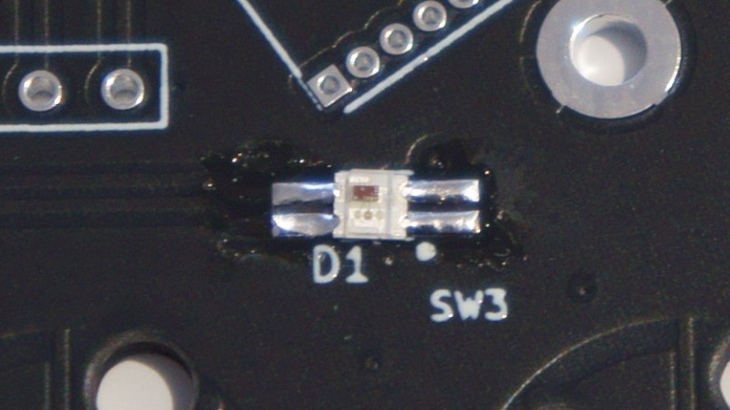             | 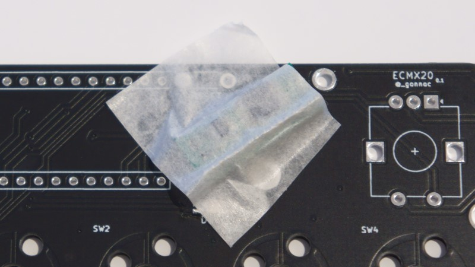 |
 | ------------------------------- | ------------------------------- |
 |  |        |
 | 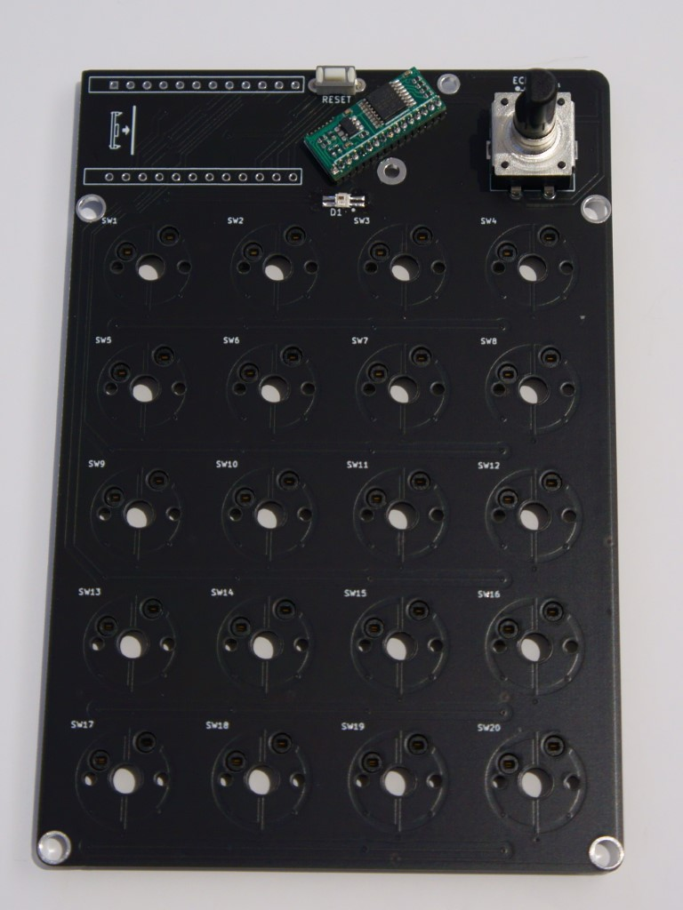     | 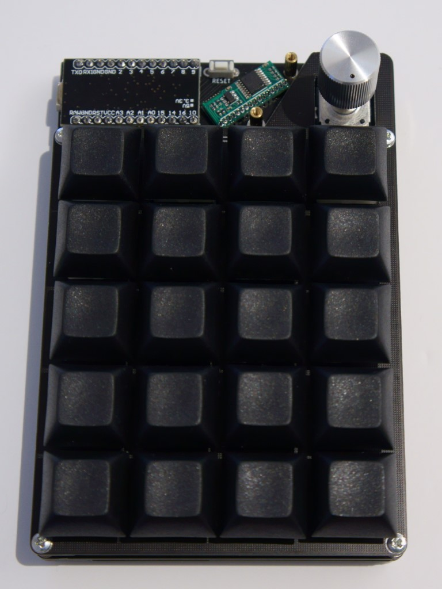   |
 | 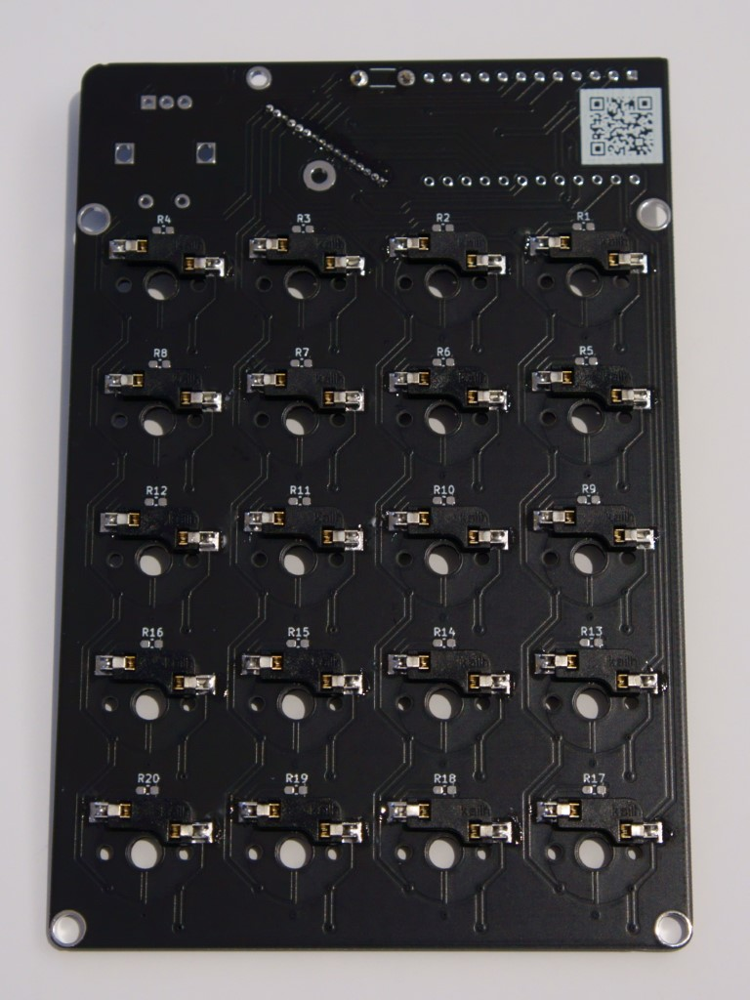       |                                 |

 - 次のステップ
   - [静電容量式スイッチの場合](#静電容量式スイッチの場合)
   - [メカニカルスイッチの場合](#メカニカルスイッチの場合)

### 静電容量式スイッチの場合
#### スイッチを組み立てる
  - プランジャに静音リングをつけて、ハウジングに入れる
    - 静音リングが途中でねじれたり巻き込まれたりしないように注意してください。

    | 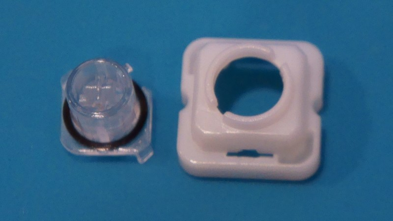 | 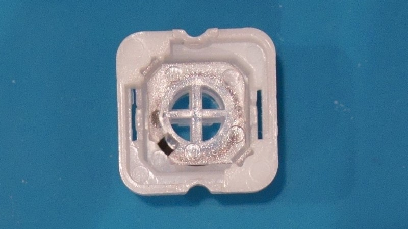 |
    | ------------------------- | ------------------------- |
    | 静音リングをつける        | ハウジングに入れる        |

#### トッププレートの組立
  - トッププレートにスイッチをはめる
    - BTOのスイッチの場合はスイッチ下部の突起が左右を向くようにしてください。
    - NiZのスイッチの場合はプランジャが簡単に抜けてしまうので、トッププレートにはめた後にキーキャップも差したほうが組み立てやすいです。
  - スペーサをネジ止め
  - スイッチの配置に合うようにラバーシートを切って載せる
  - ラバーシートに円錐バネを入れる

<details>
<summary>画像</summary>

  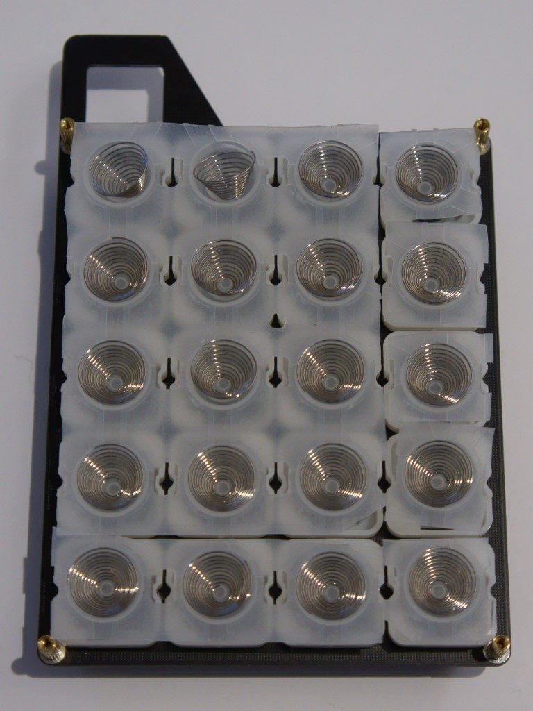
</details>

#### 全体の組立
  - メイン基板にスペーサーをネジ止め
  - ひっくり返った状態のトッププレートにメイン基板、ミドルプレート、ボトムプレートを載せてネジ止め
    - ラバーシートがずれないように注意しながら重ねてください。

| 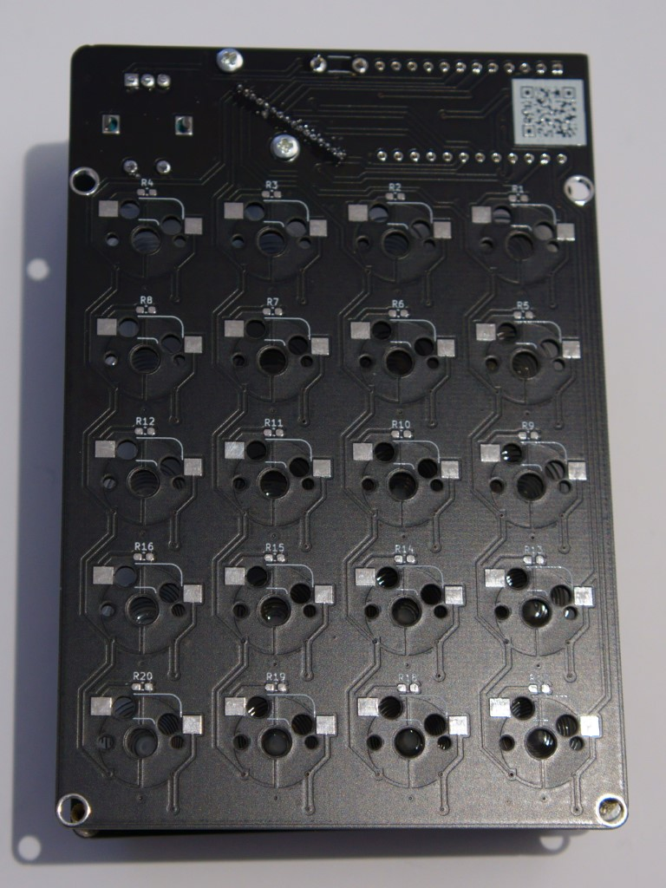 | 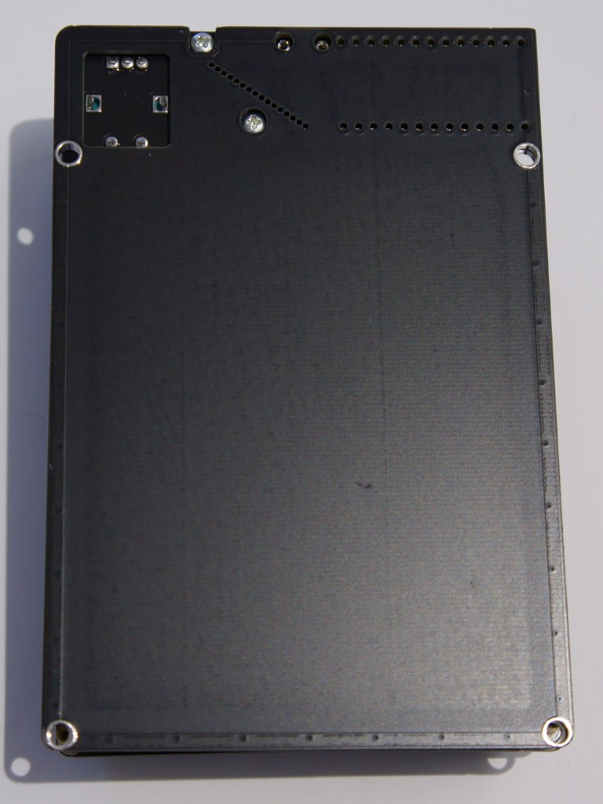 |
| ------------------------------- | ----------------------------------- |

 - 次のステップ
   - [Pro Microの取付](#静電容量メカニカルpro-microを取り付けてカバーをネジ止め)

### メカニカルスイッチの場合
  - トッププレート、メイン基板にスイッチをはめ込む
  - エンコーダの裏側にゴム足(小)を貼り付ける
  - メイン基板にスペーサを取り付ける
  - トッププレートとボトムプレートをスペーサで繋ぐ

<details>
<summary>画像</summary>

  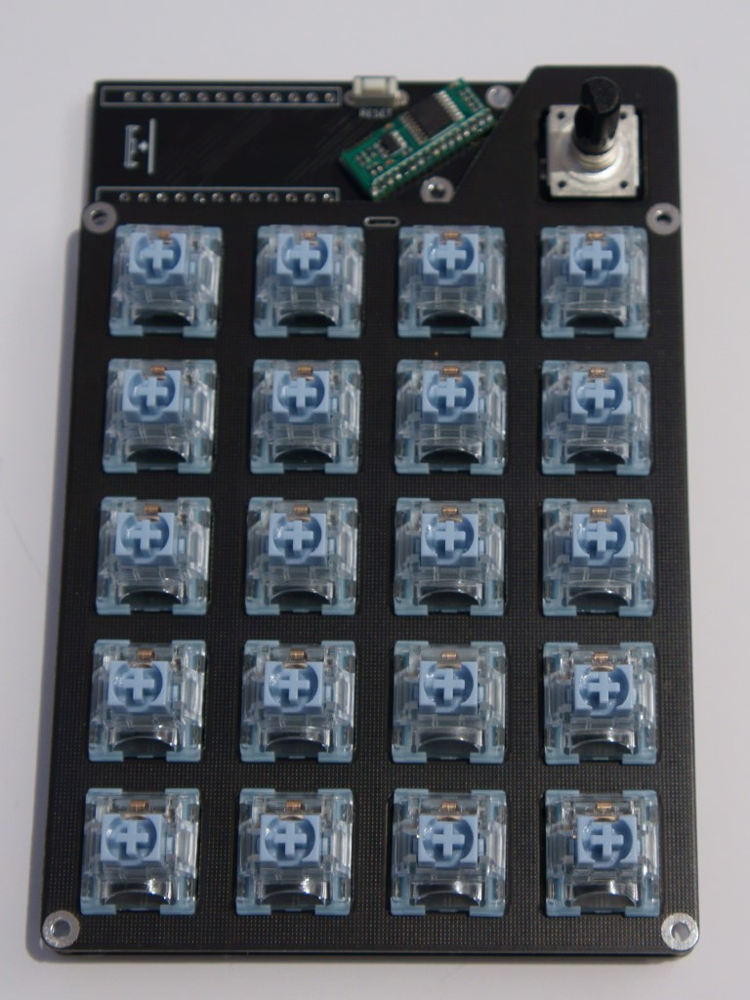
</details>

 - 次のステップ
   - [Pro Microの取付](#静電容量メカニカルpro-microを取り付けてカバーをネジ止め)

### (静電容量/メカニカル)Pro Microを取り付けてカバーをネジ止め
<details>
<summary>画像</summary>

  
</details>

### ゴム足、キーキャップをつける
  - ハードウェアはこれで完成です

### ファームウェアを書き込む
  - [Pro Micro Web Updater](https://sekigon-gonnoc.github.io/promicro-web-updater/)かqmk_toolboxを使って[テスト用キーマップ](https://github.com/sekigon-gonnoc/ecmx20/releases/download/0.1/sekigon_ecmx20_test.hex)を書き込む
      - LEDがRGB_TESTパターンで点灯します
      - AD変換値をCONSOLE経由で表示できます(後述)
      - ファームウェアの入っているリポジトリ
        https://github.com/sekigon-gonnoc/qmk_firmware/tree/dev/sekigon
        ```bash
          make sekigon/ecmx20:test:flash
        ```

### 動作点を調整する
#### AD変換値を確認する
  - [Web Serial Plotter](https://sekigon-gonnoc.github.io/web-serial-plotter/)を開く
    - 代わりにQMK Toolboxまたは[web-hid-listen](https://sekigon-gonnoc.github.io/web-hid-listen/)に接続してテキスト表示で確認することもできます
  - Baudrateのドロップダウンリストから`raw_hid`を選択して`OPEN`ボタンをクリック
  - ECMX20を選択して接続
  - 列ごとにスイッチのAD変換値がプロットされるので、スイッチを押して値の変化を確認
    - 他のキーと明らかに傾向が違うスイッチは円錐バネの位置がずれている可能性があります
  - スイッチの動作しきい値を決める
    - HIGH_THRESHOLD: この値を超えたらキーを押したと判定する
    - LOW_THRESHOLD: この値を下回ったらキーを離したと判定する
    - `LOW_THRESHOLD < HIGH_THRESHOLD` の大小関係を守ってください。差は100くらいあれば十分です
#### しきい値を設定する
    - Web Serial Plotterを閉じて[ECSKB Configurator](https://sekigon-gonnoc.github.io/ecskb-configurator/)を開く
  - 先程決めたしきい値を入力して`write`ボタンを押す
  - ECMX20を選択して接続
#### キー入力を確認する
  - [Remap](https://remap-keys.app/)に接続し、`Test Matrix`でキー入力が認識できるか確認

  | 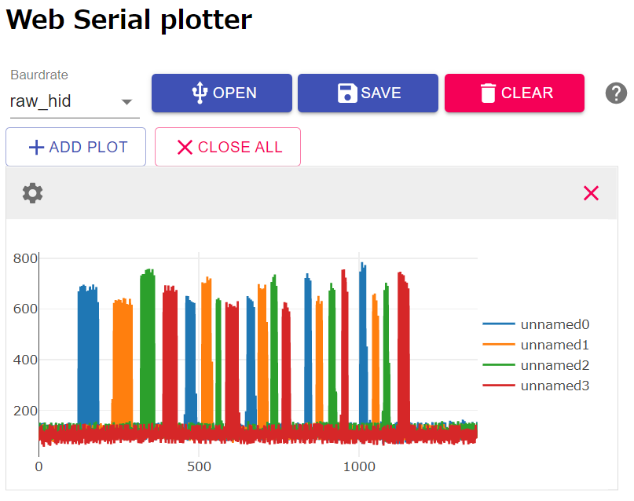 |  |
  | ------------------------------------------------- | ------------------------------------------------- |
  | 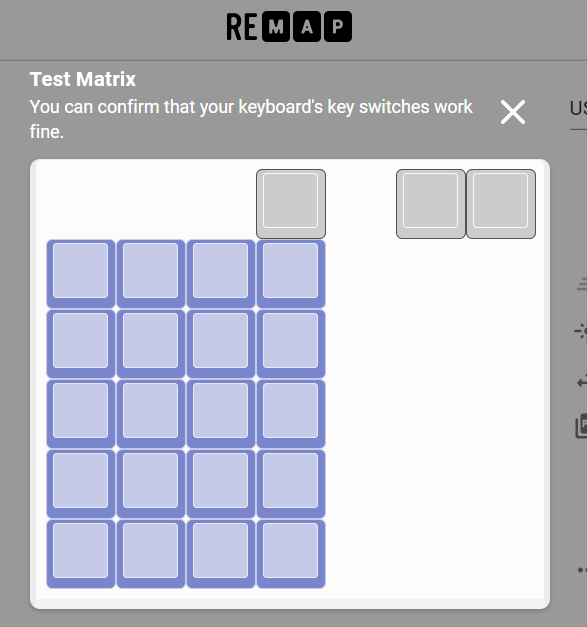                      |

### キーマップ、LEDを設定する
  - [Pro Micro Web Updater](https://sekigon-gonnoc.github.io/promicro-web-updater/)かqmk_toolboxを使って[デフォルトキーマップ](https://github.com/sekigon-gonnoc/ecmx20/releases/download/0.1/sekigon_ecmx20_default.hex)を書き込む
    - ブートローダを起動するにはリセットボタンを押すか、エンコーダを押し込みながらUSBケーブルを差し込んでください(BOOTMAGIC_LITE)
  - [Remap](https://remap-keys.app/)に接続してキーマップ/LEDを設定する
    - 右上の2キーはエンコーダの回転時に実行するキーコードです
    - LED設定は設定編集時のレイヤーごとに保存されるので、レイヤインジケータとして設定できます
      - LED設定画面を開いている間にレイヤを切り替えないでください。意図したレイヤ/設定にならない場合があります
      - そのため、`TO(x)`や`DF(x)`を使ってレイヤを切り替えてからLEDを設定することをおすすめします

###  静電容量式スイッチのルブについて
  - バネ鳴りやスイッチのカサつきはメカニカルスイッチ同様に潤滑剤を塗ることで改善する場合があります
    - ハウジングとプランジャの摺動部への塗布
    - スプリングのバッグルブ(Bag lube)
